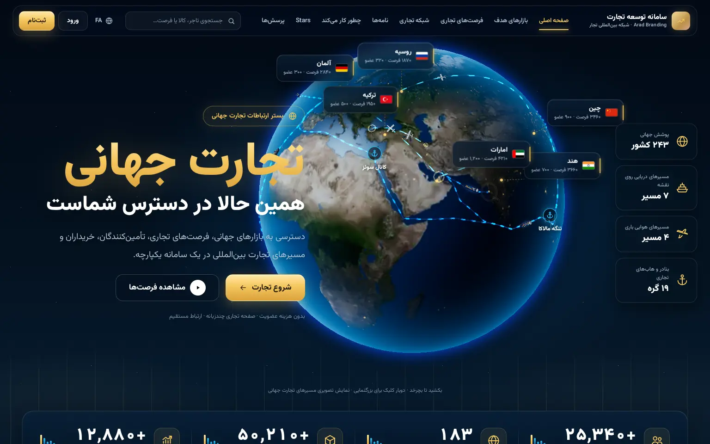

# aradbranding.app — Home page redesign (v1.16.1)

A redesign of **only the home page** (`/`) of aradbranding.app as a "global trade command center":
a real WebGL Earth (three.js) with day/night shading, atmosphere, clouds and city lights, curved
animated maritime and air routes, 3D container ships and cargo aircraft moving along them, floating
market cards anchored to the globe, and the rest of the page rebuilt in the dark navy / cyan / gold style.

No APIs, auth or database schema were changed (v1.13.0 changes contact behaviour on business pages and letters at the owner's request — see below). v1.10.1 adds an admin editor for the home page
(**Admin → «صفحه اصلی سایت»**, `/admin/home`, requires the `settings.manage` permission): every text, link, list
(add / delete / reorder rows), image and section switch of the home page, stored as one JSON value in the existing
`settings` table (`home.content`), plus “reset to defaults”. Every save is audited.



## Install

**Option A — built-in updater (recommended):** Admin → «بروزرسانی سامانه» → upload
`dist/aradbranding-1.15.0.zip (full) + dist/aradbranding-1.15.1-update.zip`. It contains only the files below plus `VERSION`, `CHANGELOG.md`
and an unchanged `bootstrap/app.php` (the updater requires it to recognise the package). No migrations.

**Option B — File Manager:** copy the contents of `site/` over the site root.

## Files

| Path | Change |
| --- | --- |
| `app/Views/public/landing.php` | Rewritten home view (all previous content kept: how it works, features, Stars, countries, FAQ + FAQ schema, CTA) |
| `app/Views/public/_trade_sprite.php` | New: SVG sprite (flags, market skylines, product art, icons, banner art) |
| `app/Modules/System/HomeContent.php` | New: home content defaults, merge and input sanitizing (links limited to `/…`, `#…`, `http(s)://…`) |
| `app/Modules/Admin/HomeAdminController.php`, `app/Views/admin/home.php`, `public_html/assets/admin-home.css` | New: `/admin/home` editor with image uploads (existing `ImageUploader`) |
| `routes/web.php`, `app/Views/admin/_nav.php` | 3 routes (`GET/POST /admin/home`, `POST /admin/home/reset`) and the admin menu item |
| `app/Modules/System/HomeController.php` | Also passes country ids (for `/discover/country/{id}` links) and per-country counts when public stats are on |
| `public_html/assets/trade-home.css` / `trade-home.js` | New page styles and small UI script (counters, menu, reveal) |
| `public_html/assets/trade-globe.js` | New: bundled 3D globe (three.js r186 tree-shaken, ~158 KB gzip) |
| `public_html/assets/globe/*.webp` | Earth textures (day, night lights, water mask, clouds) |

## How it maps to the existing site

- Header links: `/`, `/discover`, `/proposals`, `/connections`, `/letters`, `#how`, `#stars`, `#faq`; search posts to the existing `/search`; `/login`, `/register`.
- Market cards (globe + section) → `/discover/country/{id}` (ids from `ReferenceData`).
- «بازار بعدی خود را پیدا کنید» submits `q`, `country`, `type` to `/search` — the only filters the backend supports.
- Module cards → `/proposals`, `/discover`, `/connections`, `/letters`, `/pages`, `/wallet`.
- Numbers: when Admin → Settings → «نمایش آمار عمومی» is on, the strip, cards and bars show real cached totals (`MetricsService`). When off, the strip shows platform facts (243 countries, 27 languages, 6 proposal types, free membership) and cards show no counts. Nothing is invented.
- The page stays publicly cacheable and CSP-compliant (no inline styles/scripts, everything self-hosted).

## Performance / fallbacks

- Lower DPR, 1k textures, no clouds, fewer routes/ships on phones and low-memory devices; rendering pauses when the hero is off-screen or the tab is hidden.
- A textured poster globe shows while textures load and stays as the fallback without WebGL (or if the context is lost). Cards get static positions then.
- `prefers-reduced-motion`: no auto-rotation, slower movement, no reveal animations.

## Rebuilding the globe bundle

```
cd src/trade-globe && npm install && npm run build   # writes site/public_html/assets/trade-globe.js
```

Earth textures are from the three.js examples (NASA Blue Marble / Black Marble derived), converted to WebP.

## v1.11.0 — signed-in panel

- `layouts/app.php` + `public_html/assets/panel-theme.css` + `panel.js`: the whole signed-in app (dashboard, letters, proposals, admin) restyled like the home page; smaller type; mobile drawer; notifications dropdown (`GET /notifications/peek`).
- Sidebar: «ارتباطات اختصاصی» (`/letters?type=private`) under «خانه» with an unread badge (`unread_private`, added to the existing user query in `Core/Auth/Auth.php`, indexed); «پیشنهادات».
- Admin → Settings: «خرید Stars از درگاه پرداخت فعال باشد» (`payments.purchase_enabled`, default **off**). When off the purchase section and every «خرید Stars» button are hidden and `POST /wallet/buy` is refused. Files: `Core/Http/Controller.php`, `Wallet/WalletController.php`, `Pages/PublicPageController.php`, `Admin/SettingsController.php`, `admin/settings.php`, `wallet/index.php`, `public/page.php`, `letters/compose.php`, `letters/campaign.php`, `proposals/send.php`.

## v1.12.0 — admin command center and sign-in

- `layouts/app.php`, `panel-theme.css`, `panel.js`: light workspace (default) + dark navy sidebar holding every admin section (same permission checks as `admin/_nav.php`, whose in-page menu is now hidden); header with title, Jalali date, search, notifications, theme toggle, profile menu (role from `user_roles`, added to the user query in `Core/Auth/Auth.php`). `theme.js` honours `data-default-theme`.
- `/admin` dashboard (`DashboardAdminController::dashboard`, `admin/dashboard.php`): KPIs with week-over-week growth and sparklines, trend chart, today's checks, composition donut, latest platform events, newest proposals, revenue — all from `daily_metrics` (new `MetricsService::window()`, one query), cached totals, `proposal_feed` and `audit_logs`.
- `layouts/guest.php`, `auth/login.php`, `auth.css`, `auth.js`: login/register on the WebGL globe (`data-mode="login"` in `src/trade-globe/globe.js`: fewer routes, 3 ships, 2 planes, `tg:launch` zoom on submit). Same form fields and routes (email + password); no password-recovery link because the system has no recovery route.
- `public_html/assets/app.js`: the searchable select no longer auto-focuses its search box on touch screens (no keyboard pop / page jump).

## v1.12.1

- Auth pages fit one desktop frame (card scrolls inside), slogan no longer overlaps, login title/CTA texts, register field alignment, joined phone control, avatar hint under the button.
- `app.js` searchable select: list-only scrolling (no page jump) and no auto-focus on touch screens; home dropdown capped to its field width.
- Panel theme: `data-default-theme="system"` follows `prefers-color-scheme` live; the theme button cycles automatic → light → dark (`sadt-theme-mode`).

## v1.12.2

- Sign-in globe: green land corridors (`LAND_ROUTES` in `globe.js`, login mode only) Iran → Iraq / Afghanistan / Turkey with moving trucks; slimmer register card; auth brand text «سامانه توسعه تجارت».

## v1.12.3

- Home globe: Iran → Africa composite routes (`AFRICA_SEA` + green `AFRICA_LAND` with trucks) and Africa → USA/Canada sea lanes; desktop hero copy and globe no longer overlap.

## v1.12.4

- Flag cards for every route country on the home globe (`$routeCountries` in `landing.php`, skipped when the admin already lists the country); new flag symbols KE, TZ, ZA, NG, US, CA.

## v1.12.5

- Home globe: GB (London) and NL (Rotterdam) flag cards. Card declutter in `globe.js`: cards that collide (with each other or with `[data-tg-avoid]` page elements — the hero copy and side rail) move to a free slot; secondary cards with no free slot fade until the globe turns; `data-priority` overrides a card's rank.
- Target markets: a horizontal carousel (`.th-mk.is-carousel`) when more than four markets are listed — arrows, mouse drag, touch swipe and arrow keys; new default market cards DE, RU and IQ with skylines `sky-DE`, `sky-RU`, `sky-IQ`. Sites that already saved home content in the admin keep their own list: tick «نمایش در بخش بازارها» for the markets to add.

## v1.12.6

- Default opportunity «زعفران» now targets Spain (`flag-ES`). New default market cards ZA, KE, NG, US, CA and BR with skylines `sky-ZA`, `sky-KE`, `sky-NG`, `sky-US`, `sky-CA`, `sky-BR`; `LISTS['markets']` raised to 16. Saved admin content keeps its own lists (edit them in `/admin/home`).

## v1.12.7

- Market carousel arrows vertically centred. Default market KZ (`flag-KZ`, `sky-KZ`) replaces ZA; South Africa stays on the globe as a route card.

## v1.12.8

- Fewer globe cards: TZ, ZA, GB and NL removed from `$routeCountries`; default market KZ has `globe` false (still a market card). Routes are unchanged.

## v1.13.0 — contact only inside the platform

- Business pages no longer collect or show off-platform contacts: the contact fields are gone from `pages/form.php`, `PageService::encodeContent` no longer stores `contacts`, and `PublicPageController` drops any stored `contacts` (cache key `pagemodel2:`). Signed-in visitors see an in-platform «ارتباط با این کسب‌وکار» block (letter / proposal).
- `ContactGuard` (phones, e-mail, links, messenger and social IDs) now runs on save for every page text field, private letters, replies, public letters, proposal messages and profile text (`city`, `company_name`, `business_area`, `bio`). On render it masks old letter bodies, inbox previews, received-proposal notes and all page text.
- Changed files: `app/Core/Security/ContactGuard.php`, `app/Modules/Pages/{PageController,PageService,PageLabels,PublicPageController}.php`, `app/Modules/Letters/LetterController.php`, `app/Modules/Proposals/ProposalController.php`, `app/Modules/Users/AccountController.php`, `app/Views/pages/form.php`, `app/Views/public/page.php`, `app/Views/letters/{index,show}.php`, `app/Views/proposals/received.php`.

## v1.13.1

- Letters are not filtered any more (private letters, replies, public letters and the note sent with a proposal): `LetterController`, `ProposalController`, `letters/{index,show}.php` and `proposals/received.php` are back to their original code and ship in the package so 1.13.0 is overwritten. Public text stays guarded: pages, proposals (now also masked on render in `proposals/show.php` and `card.php`) and profile text.

## v1.14.0 — new logo

- Brand marks use `public_html/assets/brand/logo-192.webp` (`.brand-mark.has-logo` / `.org-avatar.has-logo` in `app.css`) in `layouts/{app,guest,public}.php`, `public/landing.php`, `letters/{index,official}.php`.
- Regenerated `favicon.ico` (16/32/48), `favicon.png`, `icons/icon-192.png`, `icons/icon-512.png`, `icons/maskable-512.png` (navy safe-zone), `icons/apple-touch-icon.png`; `?v=2` on the head links, manifest icons and OG/schema logo; service-worker cache `sadt-v2`.

## v1.15.0

A broad round on the panel, admin and integrations. It ships one forward-only migration, `database/migrations/2026_10_10_000001_reports_wallet_api.php`, which the built-in updater runs. The migration:
- adds `activity_events` indexes (`ix_user`, `ix_subject`);
- creates the `api_clients` and `api_requests` tables;
- adds the setting `pages.unlock_charge` (default false);
- grants `wallet.view/credit/debit` to the Admin role.

New:
- `/reports` («گزارش‌های من»): `Dashboard/ReportsController`, server-side SVG charts.
- `/admin/wallet` («کیف پول مشتریان»): `Admin/WalletAdminController`, with a notification and the note shown in the customer ledger.
- `/admin/api` and `/api/v1/{wallet/charge,users/lookup,users/credentials}`: `Integrations/*`, `Admin/ApiAdminController`. Docs: `docs/API-arad-contact.md`.
- Mobile-number sign-in in `AuthService::attempt`.
- Multi-filter Discover (`discover/_finder.php`, product and category filters in `MysqlSearchProvider`).

Removed:
- Account socials and privacy tabs and routes.
- The owner page-delete route (`PageController::toggle` replaces it; admins delete in `/admin/content`).
- The public-letter opt-out (`CampaignService`).

Other changes:
- Time-based auto theme (`theme.js`) and the theme menu (`panel.js`).
- Turn-taking globe cards (`globe.js`).
- Anchored, content-width combobox (`app.js`).
- No focus zoom on touch devices (`app.css`).

## v1.15.1 (incremental package)

- `dist/aradbranding-1.15.1-update.zip` holds only the changed file (`public_html/assets/trade-globe.js`) plus `VERSION`, `CHANGELOG.md` and the unchanged `bootstrap/app.php` the updater requires. Install it on top of 1.15.0.
- Globe cards: a fresh choice a few times a second picks at most 6/4/3 (desktop/tablet/phone) of the most front-facing countries whose cards fit without overlapping each other or the hero text, with a small bonus for cards already shown. Cards fade in and out in place; the slot-hopping and turn-taking logic of 1.14–1.15.0 is gone.

## v1.15.2 (incremental package)

- `dist/aradbranding-1.15.2-update.zip`: `app/Views/public/_trade_sprite.php` (corrected IQ flag; new flags NE, MR, FR, AR, PE, MX, MA, KR, ID, SG, PK, OM, SY) and `app/Views/public/landing.php` (globe cards for ES, FR, MA, MR, NE, MX, PE, AR, OM, SY, PK, KZ, KR, ID, SG). Install on top of 1.15.1.

## v1.15.3 (incremental package)

`dist/aradbranding-1.15.3-update.zip` contains the following; install it on top of 1.15.2.
- Globe cards IR, AU, ZA, TZ, GB, MY, GH, EG, LY, with new flags AU, MY, GH, EG and LY in the sprite.
- Globe layout tweaks in `trade-globe.js`: a fading card keeps its space, and overlaps between shown cards are resolved every frame.
- Trade role (`user_profiles.trade_role`):
  - migration `2026_10_11_000001_trade_role.php`;
  - `Users/TradeRoles`;
  - `Auth` loads `role_slug` and `trade_role`;
  - the panel header shows the title;
  - the account form has a chooser.
- FAQ answer corrected in `HomeContent`. Saved copies of the old text are rewritten on read via `RETIRED`.

## v1.15.4 (incremental package)

- `dist/aradbranding-1.15.4-update.zip`: `public_html/assets/panel-theme.css` (compact notifications dropdown on phones). Install on top of 1.15.3.

## v1.15.5 (incremental package)

- `dist/aradbranding-1.15.5-update.zip`:
  - `public_html/assets/app.css`: justified business-page text.
  - `app/Views/public/page.php`: the contact block follows the page language direction.
- Install on top of 1.15.4.

## v1.15.6 (incremental package)

- `dist/aradbranding-1.15.6-update.zip` (install it on top of 1.15.5):
  - `public_html/assets/app.js`: an install prompt on touch devices that are not running the installed app. It uses `beforeinstallprompt` where available and shows iOS/Android instructions otherwise. Snoozes are stored in localStorage (`sadt-install-snooze`).
  - `public_html/assets/app.css`: the popup styles, plus justified text in every box of the business page.

## v1.15.7 (incremental package)

`dist/aradbranding-1.15.7-update.zip` contains the following; install it on top of 1.15.6.
- New `partials/stars_short.php`.
- `letters/compose.php`, `letters/campaign.php`, `proposals/send.php` and `public/page.php`: when the balance is short, the send button is disabled and the notice explains the shortfall.
- `app.css`: notice and disabled-button styles.

## v1.15.8 (incremental package)

- `dist/aradbranding-1.15.8-update.zip` contains the following; install it on top of 1.15.7.
  - Exact Star amounts in admin wallet changes (`WalletAdminController`, `UserAdminController`): every non-digit is stripped after Persian/Arabic digit normalisation.
  - Quick amounts and a live balance preview (`admin/wallet.php`, `panel.js`, `panel-theme.css`).

## v1.15.9 (incremental package)

`dist/aradbranding-1.15.9-update.zip` changes «کاربران منتخب» to one handle per line and adds a live count. Install it on top of 1.15.8.
- `letters/send.php` and `letters/public_new.php`: the field is a list with one handle per line.
- `panel.js` and `panel-theme.css`: the live count and the field's styles.
- `LetterController`: a pasted page link `…/p/handle/…` is read as its handle.

## v1.15.10 (incremental package)

`dist/aradbranding-1.15.10-update.zip` replaces the logo. Install it on top of 1.15.9.
- New images: `assets/brand/logo-192.webp`, both favicons and the four PWA icons.
- Cache-busting bumps in these files: `logo-192.webp?v=2` and the icons/manifest `?v=3`, plus service-worker cache `sadt-v3`.
  - `partials/head.php`
  - the layouts
  - `landing.php`
  - the letter views
  - `app.js`
  - `service-worker.js`
  - `manifest.webmanifest`

## v1.15.11 (incremental package)

`dist/aradbranding-1.15.11-update.zip` should be installed on top of 1.15.10. It makes the sidebar brand name white (`panel-theme.css`).

## v1.15.12 (incremental package)

`dist/aradbranding-1.15.12-update.zip` replaces the logo with the gold logo (source: `brand-src/logo-gold.png`) and makes the sidebar brand name gold. Install it on top of 1.15.11.
- Cache-busting bumps: `logo-192.webp?v=3`, the icons/manifest `?v=4`, and service-worker cache `sadt-v4`.

## v1.16.0 — Trust & Safety + official API (incremental package)

`dist/aradbranding-1.16.0-update.zip` must be installed on top of 1.15.12. It runs migration `2026_10_12_000001_trust_safety`, which adds:
- tables: `abuse_reports`, `user_blocks`, `api_keys`
- columns: `users.suspended_until` / `status_reason`, `letter_messages.hidden_at` / `hidden_by`
- settings: `api.enabled`, `trust.daily_reports`

New code:
- `app/Modules/Trust/*`
- `Admin/TrustAdminController`
- `Integrations/{ApiKeys,ApiKeyController,PublicApiController}`
- refunds in `WalletService`
- services registered in `bootstrap/services.php`

API reference: `docs/API-v1.md`.

## v1.16.1 (incremental package)

`dist/aradbranding-1.16.1-update.zip` should be installed on top of 1.16.0. It is a direction and alignment fix for the proposal detail page, touching:
- `proposals/show.php`, where each block now has `dir="auto"`
- `ProposalController::find`, which now also selects the language
- `app.css`
